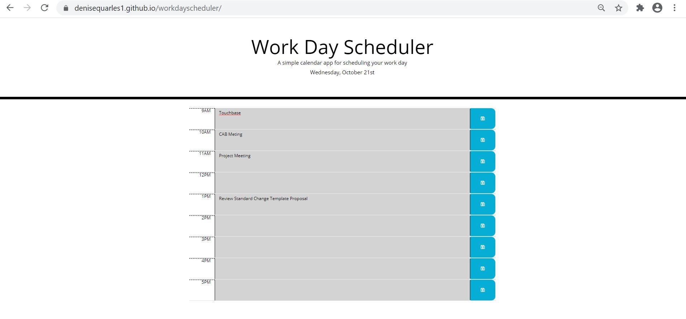

# workdayscheduler

## Table of Contents
* [Description](#description)
* [Installation](#installation)
* [Application](#application)
* [Credits](#credits)

## Description
This is a simple calendar application that allows the user to save events for each hour of the day to manage their time effectively. It runs in the browser and feature dynamically updated HTML and CSS powered by jQuery. It uses the Moment.js library to work with date and time. 

When the planner is opened, the current day is displayed at the top of the calendar.

When scrolling down, timeblocks will be presented in standard business hours. When viewing the timeblocks, each timeblock is color coded to indicate whether it is in the past, present, or future. You can click in the timeblock to enter an event. Then click the save button for the timeblock which will save the event in local storage. The saved events will still be displayed when the page is refreshed. 

 
 
  
 
 
## Installation
1. Access my GitHub repository using the following link: https://github.com/denisequarles1/workdayscheduler

2. Clone the repo by copying the key.

3. Use GitBash to enter the following: git clone [key]

4. The repository will then be copied onto your computer and you can run the index file to see the Horiseon website.

 

## Application
The deployed application can be found here: https://denisequarles1.github.io/workdayscheduler/

 

## Credits
W3Schools: https://www.w3schools.com/

Markup Validation Service: https://validator.w3.org/

